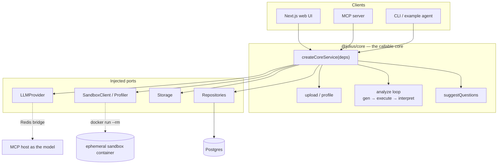

# Architecture & decisions

This is the design record for the Julius.AI clone: what it does, the calls I
made, and — as honestly as I can — where each call is *optimal* versus merely
*practical for an MVP*. The governing principle throughout: **narrow scope, deep
execution, the hard part solved for real.**

The hard part is not the chat UI. It is **securely executing untrusted,
LLM‑generated Python over a user's data and streaming the result back** — and
doing it so that both a human (the web UI) and an agent (over MCP) drive the
*same* engine. Everything below serves that.

---

## 1. System shape — one core, many clients

The load‑bearing decision. There is exactly one implementation of the analyst
pipeline — `packages/core` — and every surface is a thin client of it.

**Decision.** `createCoreService(deps)` takes injected ports —
`LLMProvider`, `SandboxClient`/`Profiler`, `Storage`, `Repositories` — and
implements the use‑cases (`upload`, `analyze`, `suggestQuestions`). The web
route handlers, the MCP tools, and the CLI all call *into* it. A shared
`createCoreServiceFromEnv()` bootstrap wires the concrete adapters from env, so
no client re‑implements wiring.

**Why it matters.** The MCP server (§5) is the project's differentiator, and the
temptation is to bolt it on as a parallel path. Every MCP analyst tool instead
routes through the same `service`/`repos` the UI uses — provably (the
`example-agent` and the web produce identical results from the same core). If
adding the agent surface had forced duplicated logic, the core was too coupled
to the UI; keeping the core UI‑free from day one is what avoided that.

**Tradeoff.** The core is a plain module, not a network service, so today all
clients run in‑process or co‑located. Extracting it behind an RPC boundary
(§10) is a deployment change, not a redesign — the seam is already there.

---

## 2. The sandbox — executing untrusted code (the hard part)

Generated Python is **untrusted by definition**: an LLM wrote it, over data I
don't control. It must run with no host access, hard limits, and real teardown.

**Decision — one ephemeral container per run.** Each execution is a fresh
`docker run --rm` from a prebuilt image (`sandbox/`), spawned per request and
torn down immediately. Isolation is enforced **at the container boundary, not in
Python**:

| Control | Flag | Defends against |
|---|---|---|
| No network | `--network none` | exfiltration, SSRF, calling home |
| Immutable FS | `--read-only` + `--tmpfs /tmp` | tampering, persistence between runs |
| No capabilities | `--cap-drop ALL` | privilege abuse |
| No privilege escalation | `--security-opt no-new-privileges` | setuid escapes |
| Unprivileged user | `--user 65534:65534` | host‑equivalent access |
| Resource caps | `--memory`, `--cpus`, `--pids-limit` | fork bombs, OOM, CPU exhaustion |
| Read‑only data | `-v <store>:/data:ro` | mutating the source dataset |
| Wall‑clock cap | app‑side timeout → `docker kill` | infinite loops |

The container runs a trusted harness (`runner.py`) that loads the dataframe,
`exec`s the user code with stdout captured, and emits **exactly one JSON
envelope** — `{ ok, stdout, stderr, artifacts }`, where artifacts are base64
PNG charts and a `result` DataFrame serialized as a table. Because the harness
owns stdout, user code can never corrupt the framing, and a user exception
becomes `{ ok: false, stderr: <traceback> }` rather than a thrown error — which
is exactly what the repair loop (§3) needs.

**Optimal vs. practical.** Hosted sandboxes (E2B, Modal) are the *operationally*
optimal answer — they remove host‑daemon exposure entirely — but they violate
the 100%‑local constraint and add a vendor. A long‑running worker with a
hardened subprocess is simpler but gives weaker isolation and no true teardown.
Ephemeral‑container‑per‑run is the sweet spot for this MVP: **real kernel‑level
isolation, real teardown, zero hosted dependencies.** The genuinely optimal
next step is stronger isolation per run — gVisor (`runsc`) or a Firecracker
microVM — which defends against kernel‑level container escapes that `--cap-drop`
does not. That's a runtime swap behind the same `SandboxClient` port.

### Threat model (and the one real residual risk)

The web tier spawns sandboxes via the **host Docker socket**
(`/var/run/docker.sock`, docker‑out‑of‑docker). That socket is root‑equivalent
on the host — it is the single most sensitive thing in the system, and I want to
name it plainly rather than hide it. The untrusted code itself is well‑contained
(table above); the residual risk is the *app tier* holding the socket. In
production I would remove that exposure with one of: a rootless Docker daemon; a
narrow spawn‑broker service that accepts only a fixed, validated `docker run`
shape; or a managed remote sandbox (E2B/Modal) so the app never touches a daemon
at all. Locally, the socket mount is the honest price of real execution on one
machine.

**Dev↔prod isolation parity.** Production already uses the managed‑sandbox option
above — E2B, with no Docker socket. And the E2B adapter now passes
`allowInternetAccess: false`, so the prod sandbox blocks network egress the same
way the Docker path's `--network none` does (tested in both adapters). Earlier
the prod path had internet by default; that asymmetry is closed.

---

## 3. The code‑gen → execute → interpret loop

**Decision.** `analyze` runs: open a `run` record (`pending`, so a failure still
leaves an audit trail) → `generateCode` → execute in the sandbox → on an
uncaught exception, feed the **traceback** back to `repairCode` and retry, up to
`maxRepairAttempts` → `interpret`. Two invariants are pinned by tests:

- **Never fabricate.** The interpretation is written *only* from executed
  stdout, and a run that never succeeded is **never interpreted** — no numbers
  are ever invented. This is both a correctness rule and a Julius product
  principle.
- **Errors are data, not dead ends.** A traceback drives a repair, not a 500.

**Tradeoff.** The repair budget is fixed and cheap (default 2). A smarter loop
could branch on error class or ask for a plan first; I kept it linear because
the failure mode that matters (a hallucinated column, a dtype mismatch) is
fixed by simply showing the model its own traceback.

---

## 4. Bring‑your‑own‑LLM — including *an MCP host as the model*

The pipeline never hard‑codes a model. `LLMConfig` (`openai-compatible` |
`anthropic`, `baseUrl`, `apiKey?`, `model`) is resolved in layers — a deployment
default plus an optional per‑request override — so you can point it at a local
Ollama, a cloud API, or let an agent bring its own model.

**The interesting adapter:** the model can be *an MCP host itself*. The `analyze`
loop calls a normal `LLMProvider`; `McpBridgeLLMProvider` enqueues each request
onto a Redis bridge and blocks until a worker answers via the MCP tools
`llm_pull_request` / `llm_submit_response`. So Claude can literally *power* the
platform, not just drive it. None of this touches the core — it is one more
`LLMProvider`, which is the payoff of the port in §1.

For the **unattended demo** (no model attached), a record/replay **cassette**
serves the seeded dataset deterministically: captured once while a model powered
the bridge, replayed with the real code re‑executing in the sandbox.
`CompositeLLMProvider` tries the cassette first and falls back to the bridge.

**Honest limits.** (a) A blocking `analyze` triggered by the same agent that
would answer it deadlocks — so the UI drives while a *separate* worker answers;
this is documented, not incidental. (b) The `openai-compatible` adapter is now
wired (`resolveProvider`) and runs in production against Groq (and locally against
Ollama) for arbitrary questions; the cassette is used only for the seeded,
zero-dependency demo path. The adapter has a request timeout + retry/backoff on
429/5xx, and records token usage per turn for cost accounting.

---

## 5. Why Julius‑as‑an‑MCP‑server matters

Julius is an MCP *client* — it consumes external MCP servers as connectors — and
has **no public API** ("Julius itself cannot be called via API," per their docs).
So exposing the platform *as* an MCP server is a genuine gap this clone fills, in
a direction Julius already cares about. `apps/mcp` exposes `upload_dataset`,
`list_datasets`, `run_analysis`, `get_code`, `get_table`, `get_chart`,
`list_conversations`, `get_conversation` — each a thin adapter over the same
core. Exposing **`get_code`** (the generated Python, not just the answer) is what
makes an analyst‑over‑MCP *auditable and composable* instead of a black box. The
`example-agent` is the living proof: it uploads, asks, and pulls back the code,
table, and chart end‑to‑end, unattended.

### 5.1 Two transports, one tool surface

**Decision.** The tools are registered once in `packages/mcp-server` and served
over **two transports**: stdio (`apps/mcp`, for a local host) and **Streamable
HTTP** (`apps/web/app/api/mcp`, for the deployment).

**Why the HTTP one is not optional.** stdio only reaches someone who has cloned
the repo and stood up Postgres, Redis, and Docker. The claim this project makes
is that *an external agent can pilot the platform* — and a reviewer who opens the
live URL can only verify that if the endpoint answers at a URL. Shipping the
differentiator behind a local-only transport is shipping it to nobody. That was
the actual state of this repo until the endpoint existed: a real gap, not a
polish item.

**What the second transport cost.** The tool logic: nothing. Extracting
`packages/mcp-server` and pointing both entry points at it was the whole change,
which is the seam from §1 paying out one level up — one core with many clients,
and now one tool surface with many transports. Had the HTTP route needed its own
copy of the tools, the seam would have been decoration.

**Stateless by construction.** `sessionIdGenerator` is undefined and each POST
builds a fresh server + transport. Vercel gives no sticky routing, so a session
in one instance's memory would vanish on the next request; the SDK requires a
fresh transport per request in this mode anyway. The cost is one initialize
round‑trip per call — cheaper than the Redis session store the alternative
needs, for tools that carry no session state. Responses come back as a single
JSON body rather than an SSE stream: this surface sends no server‑initiated
notifications, and a short response is what a serverless function can honour.
The spec's `GET` (server→client stream) and `DELETE` (session teardown) return
405 — left to the transport, `GET` opens an SSE stream that would never speak.

**Threat model.** The endpoint runs LLM‑generated Python and calls a paid model,
so it must never be more open than the site's own gate: it takes a bearer
`MCP_TOKEN` (what an MCP host can send) *or* the Basic credentials that gate the
web app (what a reviewer already holds), and is open only when neither is
configured — which is exactly local dev. It shares the per‑IP rate limiter with
the expensive web routes. The `llm_*` worker tools are deliberately **not**
registered on HTTP: `llm_pull_request` blocks waiting for work, which a
serverless function can only spend its wall clock on.

**Tested at the protocol level.** `packages/mcp-server/src/http.test.ts` drives
the real handler with a real MCP `Client`, asserting initialize → `tools/list` →
`tools/call` over a fake core — including that a stateless transport is never
reused, which is the failure mode that would otherwise only appear in
production.

---

## 6. Streaming

**Decision.** The assistant turn streams over **SSE**: `phase` events
(`generating → executing → repairing? → interpreting`) as the loop advances,
then a final `result` (prose + chart + table + code) or `error`. `analyze`
accepts an `onPhase` hook so the transport stays dumb.

**Token‑level too.** On top of the phase events, the interpretation now streams
**token‑by‑token** when the provider supports it: `interpret` takes an optional
`onToken`, the `openai-compatible` adapter reads the model's SSE deltas
(Groq/Ollama), the route forwards them as `token` events, and the UI types them
out live. Providers that can't stream (the cassette, the bridge) just return the
full text — the same seam, degrading gracefully.

---

## 7. Persistence

Postgres (Drizzle) owns `datasets → conversations → messages`, plus `runs` — the
record of every code‑gen→execute, which is what proves a number came from
executed code. The schema and repositories live **in the core**, not in the web
app, so the MCP server reuses them with zero duplicated query logic. Locally
it's an official `postgres:16` container; "Vercel Postgres / Neon" is the same
Postgres over the wire, so only the connection string changes at deploy. Each
`runs` row also carries `prompt_tokens`/`completion_tokens` — the basis for
cost‑per‑analysis accounting.

---

## 7.45 Observability &amp; cost

You can't run what you can't see. One observability seam (`apps/web/lib/analytics`)
carries the funnel (upload → question → run → chart) and errors: it always writes
structured JSON logs (`pino`, `packages/core/.../logger.ts`) and, when
`POSTHOG_KEY` is set, also emits to PostHog — a real adapter behind the seam, not
a no-op; a Sentry error sink drops in the same way. Nothing external is required
(no key → logs only), which keeps the seam honest and $0. Each `runs` row records
token usage, so `/usage` reports live unit economics — analyses, success rate,
avg duration, tokens, and estimated cost per the configured price. Cost thinking
is built in, not bolted on.

## 7.5 Measured quality — the eval harness + CI

For an AI data analyst, "it works" is a claim you must *measure*, not assert.
`packages/eval` runs the real loop over a golden set and scores two things:

- **Correctness (execution‑based):** do the expected values appear in the
  *executed* output (stdout + result table)? This checks the generated code
  computed the right thing over the real data — not that the model sounded right.
- **Faithfulness (grounding):** is every substantive *data figure* in the written
  interpretation present in the executed output? This turns the "never fabricate"
  principle from a code‑path guarantee into a *measured* property. (Derived
  percentages are excluded — requiring them verbatim would be pedantic, not
  meaningful; building the metric surfaced exactly this nuance.)

It runs in two modes: a deterministic **cassette** mode (recorded output + local
Docker sandbox — $0, used as the CI gate) and a **live** mode (real model, e.g.
Groq) for model/prompt comparison. `npm run eval` prints a scorecard and exits
non‑zero below threshold. **CI** (`.github/workflows/ci.yml`) gates every PR:
typecheck (all four workspaces) + lint + build + tests + the eval regression gate,
all free — no paid APIs are called in CI.

---

## 8. What I'd do with more time

- **Remove host‑daemon exposure** (the top item): rootless Docker, a spawn
  broker, or a managed remote sandbox — plus gVisor/Firecracker per run.
- **Real `openai-compatible` adapter** → arbitrary questions beyond the cassette,
  token‑level streaming, and true multi‑model BYO.
- **Extract the core behind an RPC boundary** so the sandbox pool scales
  independently of the web tier, with a queue and per‑session lifecycle.
- **Larger files & live DB connectors** — stream/chunk ingestion beyond in‑memory
  CSV; add read‑only warehouse connectors (a known Julius entry‑tier gap).
- **Deploy the shell to Vercel**, with the sandbox and Postgres/Redis off‑Vercel
  (the execution service can't live in a serverless function).
- **Auth, rate‑limiting, and quotas** on the execution path; richer PostHog
  funnel instrumentation (today analytics is a no‑op seam wired at the call
  sites).

## 9. Known gaps (called out on purpose)

Out of scope by design, and named here rather than half‑built: notebooks/
templates, model switching UI, slides/export, multi‑user auth/billing/teams,
files >~50MB, and live database connections. The point of the project is one
impeccable vertical slice with the dangerous part handled for real — not breadth.
